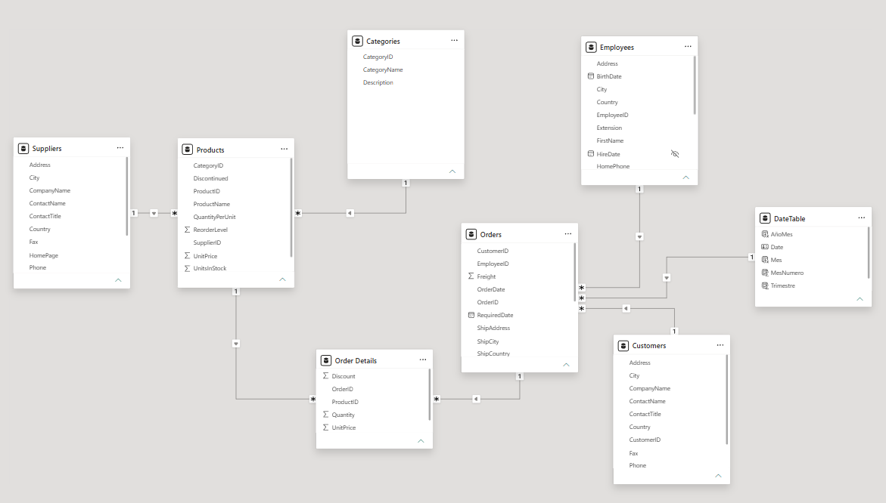
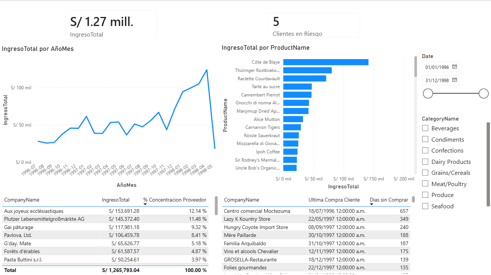
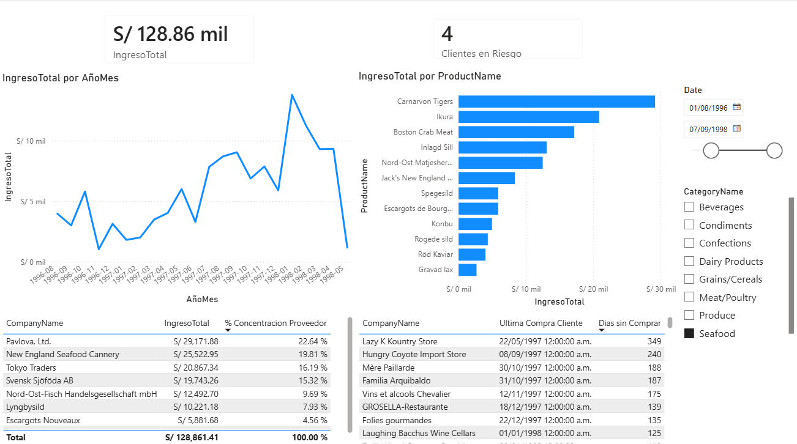

# 🔎 Northwind — Análisis de Ventas (SQL + Power BI) 🗄

<p align="center">
  
</p>

<p align="center">
   &nbsp;
   &nbsp;
   &nbsp;
</p>

## 📝 Descripción del Proyecto

Análisis end-to-end sobre la base de datos Northwind: extracción en SQL Server, dashboard interactivo en Power BI con medidas DAX.

## 🛠️ Stack

- SQL Server (T-SQL)
- Power BI Desktop (Power Query, DAX)
- Dataset: Northwind

## 📑 Queries

### 01_top_10_products
Top 10 productos por ingreso neto (`UnitPrice × Quantity × (1 - Discount)`), con categoría.

### 02_monthly_trends
Ingreso agregado por mes, jul-1996 a may-1998.

> may-1998 muestra una caída aparente porque el dataset solo llega hasta el día 6 de ese mes — no es una caída de ventas real.

### 03_frequent_customers
Clientes con más de 10 pedidos:

```sql
SELECT o.CustomerID, COUNT(OrderID) as Pedidos
FROM Orders o 
GROUP BY o.CustomerID
HAVING COUNT(OrderID) > 10
ORDER BY Pedidos desc
```

### 04_employee_performance
Ingreso por empleado, desglosado por país de cliente. USA y Alemania son los mercados principales para casi todos los empleados — el volumen depende más del mercado que del vendedor.

### 05_ranking_by_category
`RANK() OVER (PARTITION BY CategoryName ORDER BY IngresoTotal DESC)` sobre una CTE agregada, para el producto líder de cada categoría sin colapsar el detalle.

### 06_supplier_concentration
4 de 29 proveedores (14%) concentran el 41% del ingreso total. El proveedor líder (*Aux joyeux ecclésiastiques*) representa el 12.14%.

Validado en Power BI con la medida `% Concentracion Proveedor` (`CALCULATE` + `ALL`) — mismo resultado, dos métodos independientes.

### 07_churn_risk
Dos enfoques:

- **SQL (`LAG`):** gap entre última compra y penúltima, contra el promedio histórico del cliente. No cubre clientes de una sola compra.
- **DAX (Recencia):** días desde la última compra de cada cliente hasta la fecha máxima del dataset (06/05/1998). Cubre todos los clientes, sin mínimo de compras.

5 clientes con más de 180 días sin comprar. Top: *Centro comercial Moctezuma* (657 días), *Lazy K Kountry Store* (349 días).

## 📊 Dashboard

[`dashboard/northwind-dashboard.pbix`](dashboard/northwind-dashboard.pbix). Requiere Power BI Desktop + conexión a Northwind en SQL Server para refrescar.

Medidas DAX:

```dax
Ingreso Total = 
SUMX(
    'Order Details',
    'Order Details'[UnitPrice] * 'Order Details'[Quantity] * (1 - 'Order Details'[Discount])
)

% Concentracion Proveedor = 
DIVIDE(
    [Ingreso Total],
    CALCULATE([Ingreso Total], ALL(Suppliers))
)

Dias Sin Comprar = 
DATEDIFF(
    [Ultima Compra Cliente],
    CALCULATE(MAX(Orders[OrderDate]), ALL(Customers)),
    DAY
)
```




## 📂 Estructura

```
├── sql/
│   ├── 01_top_10_products.sql
│   ├── 02_monthly_trends.sql
│   ├── 03_frequent_customers.sql
│   ├── 04_employee_performance.sql
│   ├── 05_ranking_by_category.sql
│   ├── 06_supplier_concentration.sql
│   └── 07_churn_risk.sql
├── dashboard/
├── post/
├── screenshots/
└── README.md
```

## 👤 Autor

| [<br><sub>Andrio Contreras</sub>](https://github.com/DranxFa) |
| :---: |

---

## 📌 Estado del Proyecto

✅ **Finalizado** — Proyecto con fines educativos abierto a mejoras o nuevas versiones.